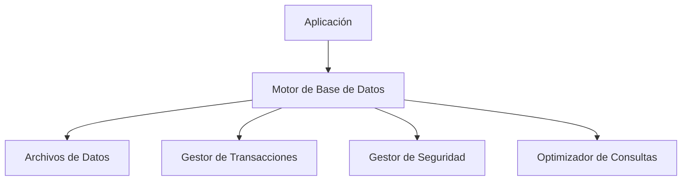
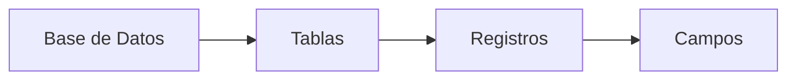
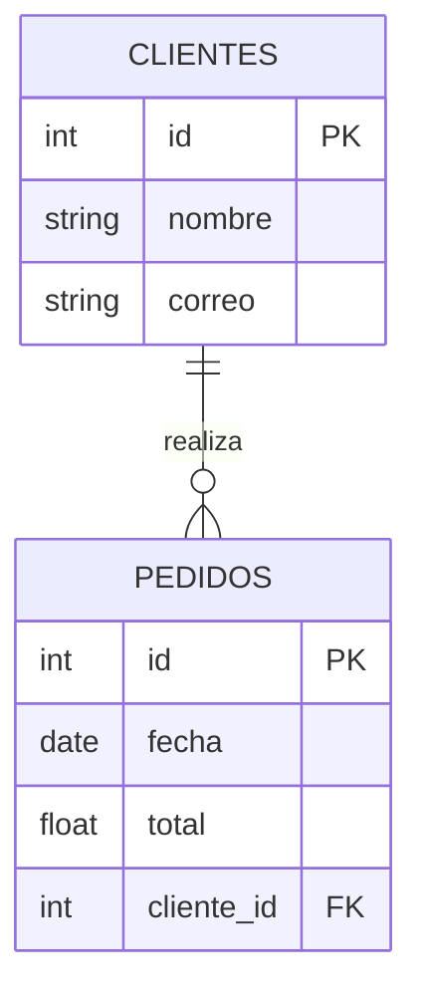
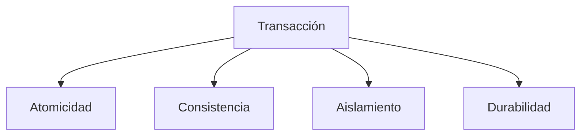
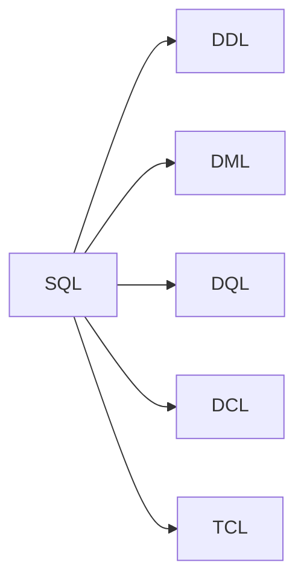
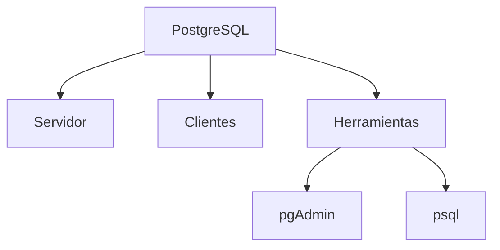
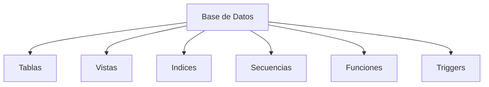
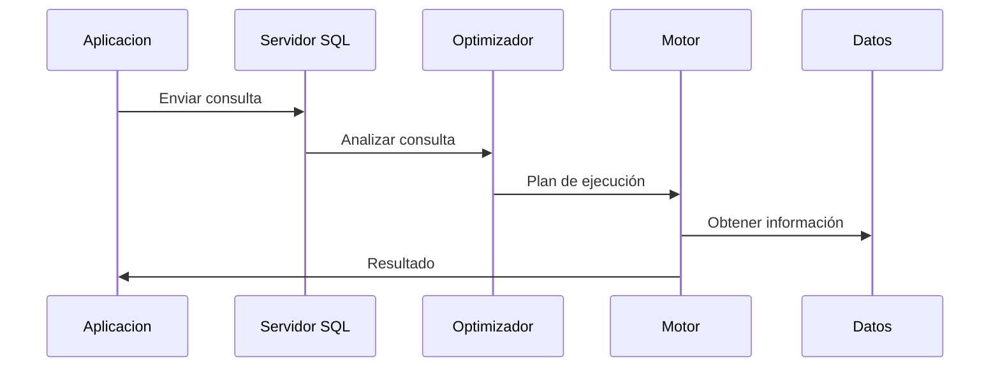

# Desarrollo de Aplicaciones Full Stack Python

## ROL Y ELEMENTOS FUNDAMENTALES DE UNA BASE DE DATOS RELACIONAL

### ¿Qué Aprenderemos?

- Las Bases de Datos Relacionales  
- El rol de las bases de datos relacionales en la organización  
- Características de un RDBMS  
- Alternativas de BD más utilizadas en la industria  
- Herramientas para consultar una base de datos  
- Instalación de PostgreSQL y herramientas utilitarias  
- Creación de conexiones a una base de datos  
- Principales objetos de una base de datos  
- Lenguaje SQL y operaciones básicas  
- Buenas prácticas en diseño de bases de datos  

---

## Arquitectura General de una Base de Datos



Este diagrama muestra cómo una aplicación se comunica con el motor de base de datos, el cual administra archivos, seguridad y transacciones.

---

## Bases de Datos

Una **Base de Datos** es una herramienta que funciona como un almacén de información. Permite guardar grandes cantidades de datos de forma organizada para poder encontrarlos y utilizarlos de manera fácil y eficiente.

### Estructura básica



---

## ¿Para qué sirven las bases de datos?

Permiten:

- Almacenar información de forma centralizada.
- Acceder rápidamente a grandes volúmenes de datos.
- Actualizar y eliminar información de manera controlada.
- Evitar duplicidad de datos.
- Garantizar seguridad e integridad.

---

## Bases de Datos Relacionales (RDBMS)

Un RDBMS organiza la información en tablas relacionadas.

### Modelo Relacional



Este diagrama representa dos tablas relacionadas mediante una llave foránea.

---

## Características de un RDBMS

- Organización en tablas  
- Relaciones mediante claves  
- Lenguaje SQL  
- Integridad referencial  
- Transacciones ACID  

### Propiedades ACID



---

## Lenguaje SQL

### Clasificación de sentencias



- **DDL:** CREATE, ALTER, DROP  
- **DML:** INSERT, UPDATE, DELETE  
- **DQL:** SELECT  
- **DCL:** GRANT, REVOKE  
- **TCL:** COMMIT, ROLLBACK  

---

## PostgreSQL – Componentes



---

## Objetos de una Base de Datos



---

## Flujo de una Consulta SQL



---

## Ejemplo Simple en SQL

```sql
CREATE TABLE clientes (
    id SERIAL PRIMARY KEY,
    nombre VARCHAR(100),
    correo VARCHAR(100)
);

INSERT INTO clientes (nombre, correo)
VALUES ('Juan Pérez', 'juan@email.com');

SELECT * FROM clientes;
```

---

## Buenas Prácticas

- Normalizar datos  
- Definir claves primarias  
- Usar índices  
- Respaldar información  
- Controlar permisos  

---

## Conclusión

Los diagramas permiten comprender visualmente cómo funcionan las bases de datos relacionales y su interacción con las aplicaciones, facilitando el aprendizaje del modelo RDBMS.
