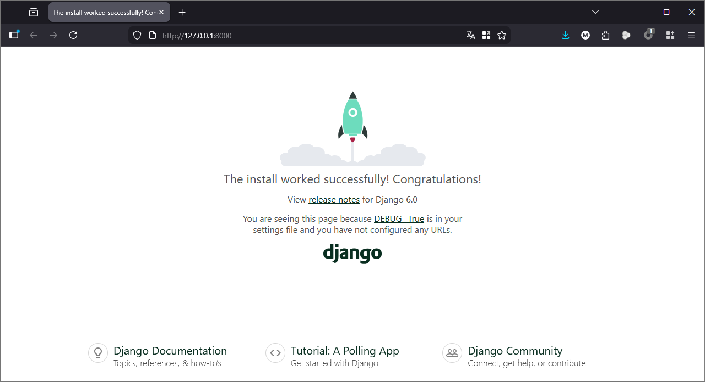
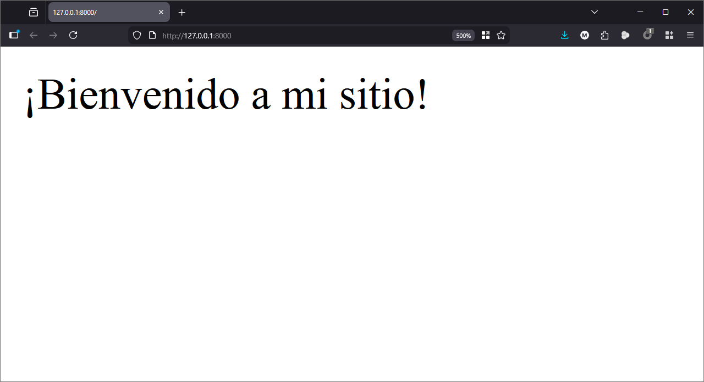

## Objetivos
- Instalar Django correctamente dentro de un entorno virtual.
- Crear y ejecutar un nuevo proyecto Django desde consola.
- Comprender la estructura inicial de carpetas y archivos que conforman un proyecto Django.
---
## Instrucciones
Crea una carpeta llamada actividad_m6_l2 y dentro de ella un documento llamado proyecto_django.md. En él deberás registrar todo el proceso de creación y configuración inicial de un proyecto Django llamado mi_sitio.

---
### 1. Instalación en entorno virtual
Desde tu terminal, ejecuta los siguientes pasos y explica en cada uno qué está ocurriendo:
```bash
python -m venv env
source env/bin/activate
pip install django
django-admin --version
```

#### Ejecución comandos
```bash
marcelo@KURURU:~/test$ python -m venv env
marcelo@KURURU:~/test$ source env/bin/activate
(env) marcelo@KURURU:~/test$ pip install django
Collecting django
  Downloading django-6.0.2-py3-none-any.whl.metadata (3.9 kB)
Collecting asgiref>=3.9.1 (from django)
  Downloading asgiref-3.11.1-py3-none-any.whl.metadata (9.3 kB)
Collecting sqlparse>=0.5.0 (from django)
  Using cached sqlparse-0.5.5-py3-none-any.whl.metadata (4.7 kB)
Downloading django-6.0.2-py3-none-any.whl (8.3 MB)
   ━━━━━━━━━━━━━━━━━━━━━━━━━━━━━━━━━━━━━━━━ 8.3/8.3 MB 20.0 MB/s eta 0:00:00
Downloading asgiref-3.11.1-py3-none-any.whl (24 kB)
Using cached sqlparse-0.5.5-py3-none-any.whl (46 kB)
Installing collected packages: sqlparse, asgiref, django
Successfully installed asgiref-3.11.1 django-6.0.2 sqlparse-0.5.5

[notice] A new release of pip is available: 25.1.1 -> 26.0
[notice] To update, run: pip install --upgrade pip
(env) marcelo@KURURU:~/test$ django-admin --version
6.0.2
```
Comenta: ¿Qué es pip? ¿Qué ventajas ofrece instalar Django dentro de un entorno virtual?

> pip es el gestor de paquetes de Python. Permite instalar, actualizar y administrar librerías externas.
>- Ventajas de instalar Django en un entorno virtual:
>   - Evita conflictos entre versiones de librerías.
>   - Permite tener proyectos independientes con sus propias dependencias.
>   - Facilita la portabilidad y replicación del entorno en otros equipos.

---
### 2. Crear el proyecto
- Crea el proyecto con el comando:
```bash
django-admin startproject mi_sitio
```

- Copia la estructura generada por Django y pégala en tu archivo .md explicando para qué sirve cada uno de los siguientes elementos:

#### Explicación de cada archivo
- **manage.py**: Script principal para ejecutar tareas administrativas del proyecto.
- **mi_sitio/init.py**: Indica que la carpeta  es un paquete de Python.
- **mi_sitio/settings.py**: Contiene la configuración global del proyecto: base de datos, aplicaciones instaladas, rutas de archivos estáticos, etc.
- **mi_sitio/urls.py**: Define el enrutamiento de URLs hacia las vistas correspondientes.
- **mi_sitio/asgi.py**: Configuración para servidores ASGI (soporte para aplicaciones asincrónicas).
- **mi_sitio/wsgi.py**: Configuración para servidores WSGI (modo clásico de despliegue en producción)

---
### 3. Ejecutar el servidor
- Corre el servidor de desarrollo con:
```bash
python manage.py runserver
```

- Visita http://127.0.0.1:8000/ y toma una captura de pantalla mostrando que el servidor funciona correctamente.



---
### 4. Crear una aplicación
- Crea una aplicación llamada principal:
```bash
	python manage.py startapp principal
```

- Explica brevemente:
    - ¿Qué diferencia hay entre un “proyecto” y una “aplicación” en Django?

> Diferencia entre proyecto y aplicación
> - Proyecto: Es la configuración global que agrupa varias aplicaciones.
> - Aplicación: Es un módulo dentro del proyecto que cumple una función específica (ej. blog, tienda, foro).

- ¿Qué carpetas se generan dentro de la app principal?
```bash
migrations/
admin.py
apps.py
__init__.py
models.py
tests.py
views.py
```

---
### 5. Configuración del proyecto
- Agrega 'principal' al INSTALLED_APPS de settings.py.
```python
INSTALLED_APPS = [
    'django.contrib.admin',
    'django.contrib.auth',
    'django.contrib.contenttypes',
    'django.contrib.sessions',
    'django.contrib.messages',
    'django.contrib.staticfiles',
    'principal',
]
```
- Crea un archivo urls.py dentro de la app principal y configura el enrutamiento en mi_sitio/urls.py para que dirija hacia esa app.

`pricipal/urls.py`
```python
from django.urls import path
from . import views

urlpatterns = [
    path('', views.inicio, name='inicio'),
]

```

Puedes usar una vista sencilla que devuelva HttpResponse("¡Bienvenido a mi sitio!").

`pricipal/views.py`
```python
from django.http import HttpResponse

def inicio(request):
    return HttpResponse("¡Bienvenido a mi sitio!")
```

`misitio/urls.py`
```python
from django.contrib import admin
from django.urls import path, include

urlpatterns = [
    path('admin/', admin.site.urls),
    path('', include('principal.urls')),
]
```


Entregables
• Carpeta comprimida (.zip) que contenga:
• El archivo proyecto_django.md con toda la explicación y comandos utilizados
• Una captura de pantalla del servidor funcionando
• (Opcional) El proyecto Django en versión funcional